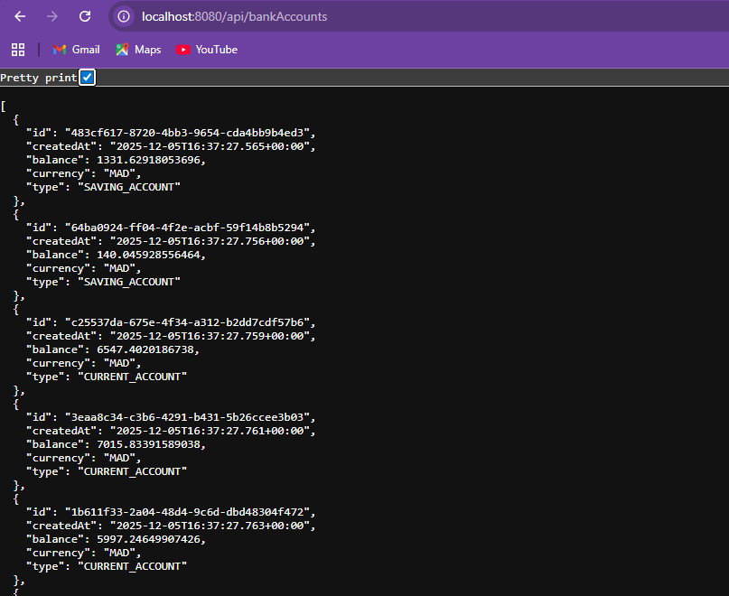
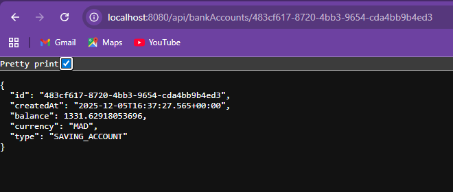
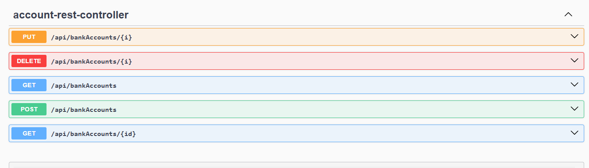
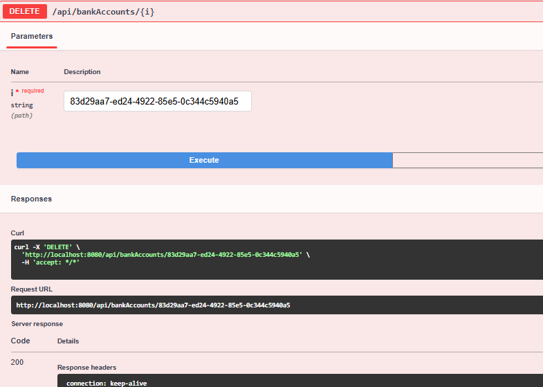
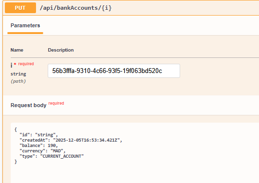
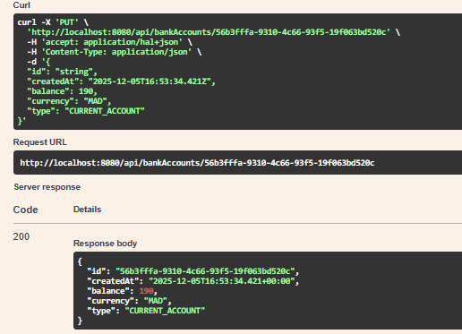
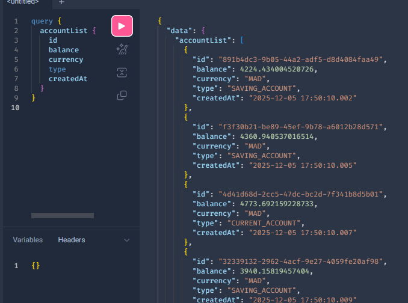
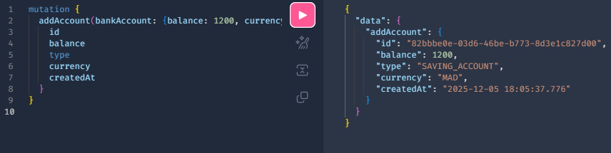
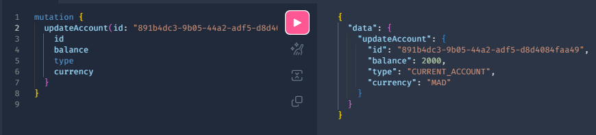
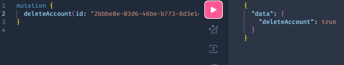

# Bank Account Service – Rapport

Service Spring Boot pour la gestion de comptes bancaires avec API REST, GraphQL, Swagger et base H2.

## Fonctionnalités
- CRUD des comptes bancaires (REST et GraphQL)
- Spring Data REST pour l’exposition automatique des repositories
- Swagger UI et OpenAPI (`/swagger-ui/index.html`, `/v3/api-docs`)
- Base H2 en mémoire avec données de démo générées au démarrage
- DTO + mapper pour isoler l’entité de la couche web

## Stack
- Java 17, Spring Boot 3.5.x
- Spring Web, Spring Data JPA, H2
- Spring GraphQL
- springdoc-openapi-starter-webmvc-ui
- Lombok

## Endpoints REST
- `GET /api/bankAccounts`
- `GET /api/bankAccounts/{id}`
- `POST /api/bankAccounts`
- `PUT /api/bankAccounts/{id}`
- `DELETE /api/bankAccounts/{id}`
- Spring Data REST : `GET /bankAccounts`, `GET /bankAccounts/{id}`, etc.

## Opérations GraphQL (http://localhost:8080/graphiql)
Queries :
```graphql
query { accountList { id balance currency type createdAt } }
query { bankAccountById(id: "ID") { id balance type } }
query { accountsByType(type: CURRENT_ACCOUNT) { id balance } }
```
Mutations :
```graphql
mutation { addAccount(bankAccount: {balance: 1200, currency: "MAD", type: SAVING_ACCOUNT}) { id balance type createdAt } }
mutation { updateAccount(id: "ID", bankAccount: {balance: 2000, currency: "MAD", type: CURRENT_ACCOUNT}) { id balance type } }
mutation { deleteAccount(id: "ID") }
```

## Configuration
`src/main/resources/application.properties` :
```
spring.datasource.url=jdbc:h2:mem:account-db
spring.h2.console.enabled=true
spring.graphql.graphiql.enabled=true
server.port=8080
```
Accès : H2 console `http://localhost:8080/h2-console`, JDBC `jdbc:h2:mem:account-db`, user `sa`, mdp vide.

## Démarrage
```bash
./mvnw clean package
./mvnw spring-boot:run
```
Swagger UI : `http://localhost:8080/swagger-ui/index.html`  
GraphiQL : `http://localhost:8080/graphiql`

## Structure projet (java/main)
```
com/tp/bankaccservice/
├── BankAccServiceApplication.java
├── dto/
├── entities/
├── enums/
├── mappers/
├── repositories/
├── services/
└── web/
```

## Tester les endpoints
- GET REST `GET /api/bankAccounts` depuis le navigateur, affichant la liste brute des comptes en JSON.
    
-  GET REST `GET /api/bankAccounts/{id}` avec un id donné, affichant un compte en JSON.
   
-  vue Swagger UI listant les endpoints REST du contrôleur `account-rest-controller` (GET/POST/PUT/DELETE).
   
-  exécution DELETE dans Swagger UI (`/api/bankAccounts/{id}`) avec l’URL et le curl généré, réponse 200.
  
-  formulaire Swagger UI pour PUT `/api/bankAccounts/{id}`, avec path param et body JSON.
  
- exécution PUT dans Swagger UI montrant le curl généré, l’URL appelée et la réponse 200 avec l’objet mis à jour.
   
- requête GraphQL `accountList` dans GraphiQL, avec la liste des comptes (id, balance, currency, type, createdAt).
   
- requête GraphQL `bankAccountById` dans GraphiQL, filtrée par id, retournant id, balance et type.
   
- mutation GraphQL `addAccount` créant un compte SAVING_ACCOUNT (balance 1200, currency MAD) et renvoyant l’objet créé avec createdAt.
  
   
- mutation GraphQL `updateAccount` mettant à jour un compte (balance 2000, type CURRENT_ACCOUNT, currency MAD) et renvoyant les champs id/balance/type/currency.
   
- mutation GraphQL `deleteAccount` supprimant un compte par id et retournant `true`.
  
